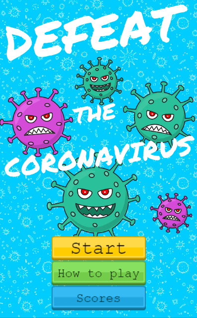
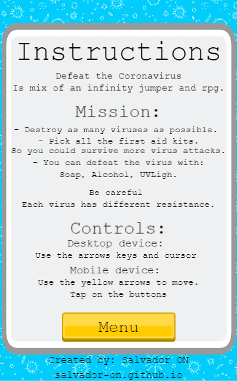
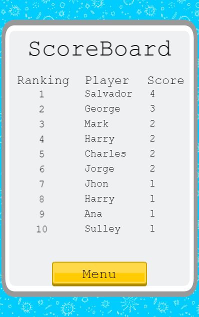
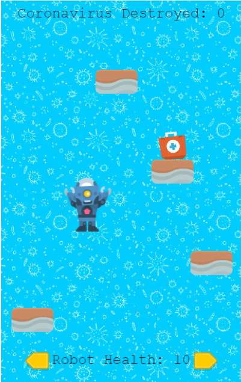
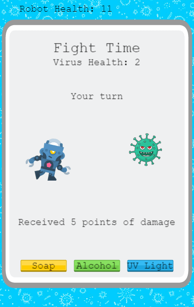
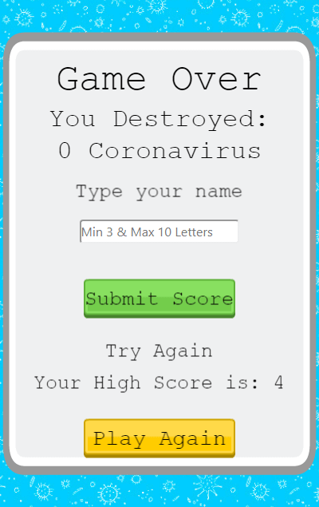

# Coronavirus Game

<div align="center"></div>

## Table of Contents

* [About the Project](#about-the-project)
* [The Game](#the-game)
  * [How to Play](#how-to-play)
  * [Instalation](#instalation)
  * [Testing](#testing)
  * [Characters](#characters)
  * [Scenes](#scenes)
* [Tecnologies used](#tecnologies-used)
* [Author](#author)
* [Show your Support](#show-your-support)
* [Project Scope](#project-scope)

<!-- ABOUT THE PROJECT -->
## About The Project

This project consists on building a RPG video game using JavaScript and the game engine Phaser

The live version of the project: [Live version](https://defeat-the-coronavirus.netlify.app/)

<!-- THE GAME -->
## The game

In this game, I mix an RPG game with an infinity jumper to build a dynamic and entertaining game.

In this game, you will face the Coronavirus. Your objective is to find all the Coronavirus that you can and destroy them.

But be careful, you will need to move from one platform to another until you find it.

During the game, you will find some first aid kits. Collect them so you could improve your health and survive the coronavirus Attack.

Every time that you find a coronavirus. You will need to destroy it.

You have 3 weapons to destroy the coronavirus: Soap, Alcohol, UV Light.

Be smart because each virus has different resistance, level of health, and attack. So you need to find which of your weapons is the most effective against each virus. So you can destroy it without receiving to much damage.

The mission will be over if your health becomes 0 or if you fall from the platforms.


<!-- HOW TO PLAY -->
### How to Play

- Desktop: You can move around using the arrow keys on the keyboard. To click a button use the cursor.

- Mobile Devices: You can move using the yellow arrow buttons on the screen. You can tap on all the buttons.

<!-- INSTALLATION -->
### Installation

You can always use the [live version](https://defeat-the-coronavirus.netlify.app) to play right away or install it locally using these steps:

#### Clone my repository

`$ git clone https://github.com/Salvador-ON/Coronavirus-Game.git`

#### Go to my project's folder

`$ cd Coronavirus-Game`

#### Get the dependencies needed for the game

`$ npm install`

#### Start the server and the fun
`$ npm run start`

<!-- CHARACTERS -->
### Characters

* Player Robot: <div ></div>
He can move from right to left, and it automatically jumps on each platform. You start the game with 10 points of health.

* Enemy Coronavirus : <div ></div>
It will appear randomly after some platforms that you jump. It has between 3 to 10 points of health.
Each virus has a different damage attack and different resistance to Soap, Alcohol, and Uv Light. 

* First Aid Kit:  <div ></div>
It will appear randomly after some platforms that you jump. Each first aid kit that you collect, give you 3 extra points of health.

<!-- testing -->
### Testing

The unit test includes testing on the retrieve firestore query to retireve the data and to submit the data.

Before running the test is necesary to modify the next file to remove the firebase-admin.

Go to:
`node_modules/firestore-jest-mock/mocks/firebase.js`


Replace this lines:
```
const mockFirebase = (overrides = {}) => {
  jest.mock('firebase', () => firebaseStub(overrides)) &&
    jest.mock('firebase-admin', () => firebaseStub(overrides));
};

```
With this lines:
```
const mockFirebase = (overrides = {}) => {
  jest.mock('firebase', () => firebaseStub(overrides))
};
```
and the run the test.

`$ npm run test`

<!-- SCENES -->
### Scenes

* Start 

<div></div>

* Instructions

<div></div>

* Score

<div></div>

* Game 

<div></div>

* RPG 

<div></div>

* Game Over

<div></div>


<!-- TECNOLOGIES USED -->
## Tecnologies used

*   HTML5.
*   Phaser 3.
*   CSS.
*   Webpack.
*   Javascript.
*   Eslint.
*   Babel.
*   Jest for testing.
*   Firestore to manage and save the scores.
*   Netlify for deployment.


<!--AUTHOR -->
## Author

**Salvador Olvera Nava**

- Github: [@Salvador-ON](https://github.com/Salvador-ON)
- Twitter: [@Salvador_ON](https://twitter.com/Salvador_ON)
- Linkedin: [Salvador Olvera](https://www.linkedin.com/in/salvador-olvera-n)

<!-- SHOW YOUR SUPPORT -->
## Show your Support

Give a star if you like this project!


- Assets by: 
  * [Kenney](https://kenney.nl/assetsk)
  * [nickfz](https://pngtree.com/nickfz_14826052?type=1)


<!-- project-scope -->
## Project Scope

### 1. Project Purpose Statement:	

Development of an RPG game as apart of my Microverse Capstone Project to show all the technical skills that I  learned through the Javascript Curriculum. Using for this project Phaser 3 Framework. to develop the game

### 2. Objectives:

- [x] Design of the turn-based RPG game dynamic.
- [x] Research and Development of all the media content that is going to be used on the game
- [x] Development of the turn-based RPG game.
- [x] Development of a backend database to storage the scores games using Firestore.
- [ ] Development of multilingual game.

### 3. Approach:

* The project is going to be divided in 5 stages. to secure the success of the projects.

* The first two days are going to be used to get familiar with Phaser 3 framework. and Design content

* The third day is going to be used to develop the basic game play with the different scenes (Start, Navigation, RPG Fight, Scoreboard, GameOver)

* The fourth day is going to be used to develop the firestore database to save the scores and display the scoreboard. And make the integration with the game.

* The fifth day is going to be used to develop the unit test using Jest to test all the logic of the game.

### 4. Timeframe & Milestones:
* Day 1: Research and learning about Phaser 3.
* Day 2: Game Design, Creation and Download of all the media content.
* Day 3: Game Development: Functional game-play
* Day 4: Development and integration of the Firestore database.
* Day 5: Development of unit test using jest.
